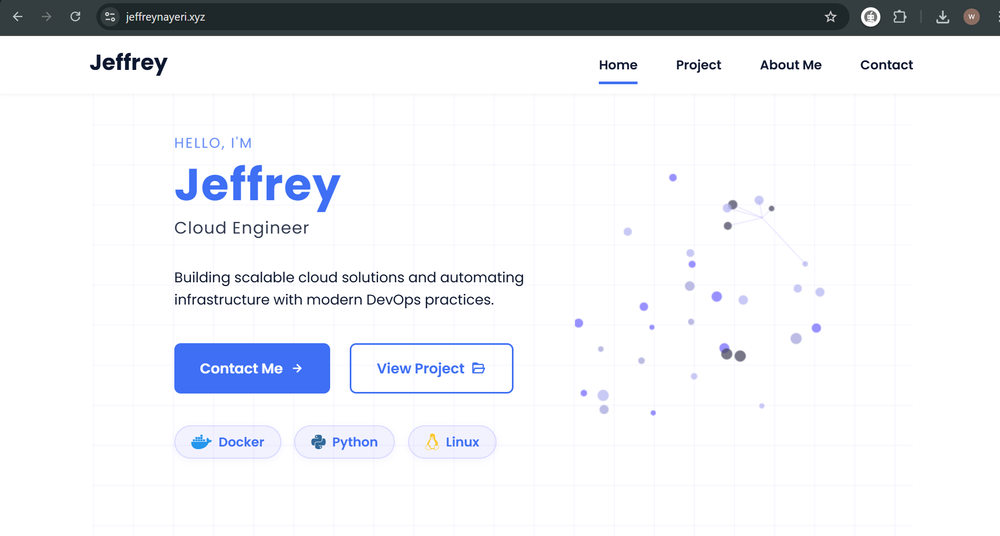

# AltSchool Cloud Project

A cloud-based web server deployment on AWS using Terraform, Nginx, and a custom domain with HTTPS.

---

## Directory Structure

```text
AltSchool-Cloud-Project/
├── src/
│   ├── assets/
│   │   ├── css/
│   │   │   └── styles.css
│   │   └── img/
│   │   |    ├── profile-1.jpg
|   |   |    ├── screenshot.png
│   │   |    └── work3.jpg
│   |   ├── js/
│   │   |    └── main.js
│   |   └── scss/
│   │       └── styles.scss
│   └── index.html
├── terraform/
│   ├── backend.tf
│   ├── instance.tf
│   ├── keypair.tf
│   ├── provider.tf
│   ├── secgrp.tf
├── .gitignore
└── README.md
```

---

## 📋 Table of Contents

1. [Project Overview](#project-overview)
2. [Prerequisites](#prerequisites)
3. [Steps to Deploy](#steps-to-deploy)

   1. [Provision AWS EC2 with Terraform](#1-provision-aws-ec2-with-terraform)
   2. [Push to GitHub repository](#2-push-to-github)
   3. [Install & Configure Nginx](#3-install--configure-nginx)
   4. [Configure Domain DNS](#4-configure-domain-dns)
   5. [Secure with Let’s Encrypt](#5-secure-with-lets-encrypt)
   6. [Verify Deployment](#6-verify-deployment)
4. [Deployment](#deployment)


---

## Project Overview

This project demonstrates how to:

*  Provision and configure an AWS EC2 instance with Terraform
*  Serve a dynamic landing page via Nginx
*  Map a custom domain
*  Secure traffic with Let’s Encrypt SSL

---

## Prerequisites

* AWS account & IAM user with sufficient permissions
* Terraform v1.x installed
* Git & GitHub account
* A registered domain 
* VS Code (or your preferred editor)

---

## Steps to Deploy

### 1. Provision AWS EC2 with Terraform

1. Create your Terraform configs:

   * `backend.tf`
   * `provider.tf`
   * `keypair.tf`
   * `secgrp.tf` 
   * `instance.tf`

2. Initialize, format, validate, plan & apply:

   ```bash
   cd terraform/
   terraform init
   terraform fmt
   terraform validate
   terraform plan
   terraform apply
   ```

3. Note the public IP output by Terraform (or fetch it from the AWS console):

   ```bash
   terraform output public_ip
   ```

---

### 2. Push to GitHub repository

1. In your local project directory:

   ```bash
   git init
   git add .
   git commit -m "Initial commit: Terraform configs + web files"
   git remote add origin https://github.com/yourusername/AltSchool-Cloud-Project.git
   git push -u origin main
   ```

---

### 3. Install & Configure Nginx

1. SSH into your instance:

   ```bash
   ssh -i your-key.pem ubuntu@<PUBLIC_IP>
   ```

2. Install Nginx:

   ```bash
   sudo apt update
   sudo apt install nginx -y
   ```

3. Clone your repo into the web root:

   ```bash
   sudo git clone https://github.com/yourusername/AltSchool-Cloud-Project.git /var/www/html
   ```

4. Move ```src``` files into place:

   ```bash
   sudo mv /var/www/html/src/* /var/www/html/
   sudo chown -R ubuntu:ubuntu /var/www/html
   sudo chmod -R 755 /var/www/html
   ```

5. Restart Nginx:

   ```bash
   sudo systemctl restart nginx
   ```

---

### 4. Configure Domain DNS

1. On Dynadot (or your preferred registrar), go to **Manage DNS**.

2. Add an **A** record:

   | Name | Type | Value         | TTL  |
   | ---- | ---- | ------------- | ---- |
   | @    | A    | `<PUBLIC_IP>` | 3600 |

3. Wait for propagation (verify with `ping <yourdomain.com>`).


4. Edit your Nginx configuration file (`/etc/nginx/sites-available/yourdomain.conf`) to set `server_name` to your custom domain:

```bash
server {
    listen 80;
    server_name example.com www.example.com;
    root /var/www/html;
    index index.html index.htm;

    location / {
        try_files $uri $uri/ =404;
    }
}
```

5. Test & Restart Nginx:

   ```bash
   sudo nginx -t
   sudo systemctl restart nginx
   ```

---

### 5. Secure with Let’s Encrypt

1. Install Certbot:

   ```bash
   sudo apt install certbot python3-certbot-nginx -y
   ```

2. Obtain & install a certificate:

   ```bash
   sudo certbot --nginx -d <yourdomain.com>
   ```

3. Follow prompts to enable HTTP→HTTPS redirection.

4. Test auto-renewal:

   ```bash
   sudo certbot renew --dry-run
   ```

---

### 6. Verify Deployment

* Browse to: `https://yourdomain.com`
* Confirm your landing page loads with name, project pitch, About, Contact etc.

---

## Deployment

* **URL:** `jeffreynayeri.xyz`
* **Public IP:** `34.240.10.170`




---